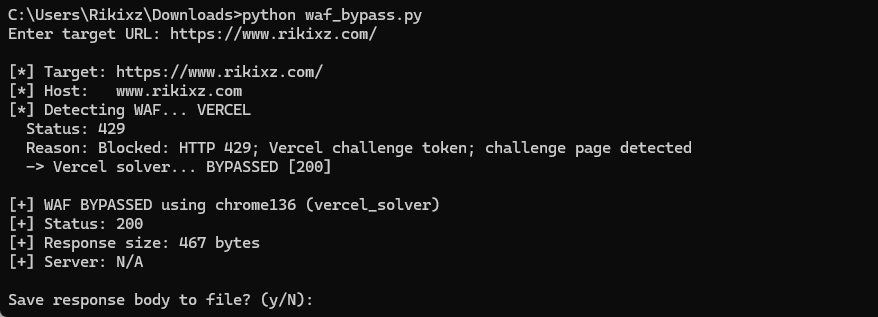

<h1 align="center">WAF Bypass</h1>

<p align="center">
  <b>Auto-detect & bypass Vercel PoW, Cloudflare, AWS, Akamai, Imperva, Sucuri, F5, ModSecurity</b>
</p>

<p align="center">
  
  
</p>

## Features

- **Vercel PoW** — Full proof-of-work solver (SHA-256 nonce brute force)
- **Cloudflare** — cloudscraper JS challenge bypass
- **AWS CloudFront** — Browser profile rotation
- **Akamai** — Profile rotation + slow proxy pass
- **Imperva / Sucuri** — Cloudscraper + curl_cffi fallback
- **F5 / ModSecurity** — Header manipulation & profile rotation
- **Auto-detection** — Identifies WAF type from response headers, cookies, and body
- **CLI + Library** — Use as a command-line tool or import in your Python project

## Quick Install

```bash
pip install curl_cffi cloudscraper requests
```

| Package | Required For |
|---------|-------------|
| `curl_cffi` | Vercel, AWS, Akamai, F5, ModSecurity |
| `cloudscraper` | Cloudflare, Imperva, Sucuri |

## Usage

### Command Line

```bash
python waf_bypass.py -t https://target.com
python waf_bypass.py -t https://target.com --proxy http://127.0.0.1:8080
python waf_bypass.py -t https://target.com --timeout 60
```

### As a Library

```python
from waf_bypass import WAFBypass

# Create bypasser
b = WAFBypass(proxy="http://127.0.0.1:8080", timeout=30)

# Auto-detect and bypass
result = b.bypass("https://target.com")

if result.bypassed:
    print(f"[+] Bypassed! HTTP {result.status_code}")
    print(f"[+] Method: {result.method_used}")
    print(f"[+] Profile: {result.profile_used}")
    print(f"[+] Response: {len(result.body)} bytes")
else:
    print(f"[-] Blocked: {result.error}")
```

### Get a Pre-Bypassed Session

```python
session, result = b.get_bypassed_session("https://target.com")
# session is a curl_cffi Session ready to make authenticated requests
resp = session.get("https://target.com/protected-page")
```

## API Reference

### `WAFBypass(proxy=None, timeout=30, default_profile="chrome136", delay=(0.5, 2.0))`

| Parameter | Type | Default | Description |
|-----------|------|---------|-------------|
| `proxy` | `str` | `None` | Proxy URL (e.g. `http://127.0.0.1:8080`) |
| `timeout` | `int` | `30` | Request timeout in seconds |
| `default_profile` | `str` | `"chrome136"` | Default browser impersonation |
| `delay` | `tuple` | `(0.5, 2.0)` | Random delay range between requests |

### `bypass(url, quiet=False) -> WAFResult`

| Field | Type | Description |
|-------|------|-------------|
| `bypassed` | `bool` | True if WAF was successfully bypassed |
| `status_code` | `int` | HTTP response status code |
| `headers` | `dict` | Response headers |
| `body` | `str` | Full response body |
| `method_used` | `str` | Which bypass method worked |
| `profile_used` | `str` | Which browser profile was used |
| `error` | `str | None` | Error message if bypass failed |

## Browser Profiles

| Name | Impersonates |
|------|-------------|
| `chrome136` | Chrome 136 on Windows |
| `chrome131` | Chrome 131 on Windows |
| `safari18` | Safari 18 on macOS |
| `firefox135` | Firefox 135 on Windows |
| `edge136` | Edge 136 on Windows |

## How the Vercel PoW Solver Works

1. Extract challenge token from `x-vercel-challenge-token` header
2. Parse token fields: request_id, difficulty, seed2, seed3, count
3. For each round: compute SHA-256(seed2 + nonce) until hash starts with the expected 4-char hex prefix
4. Submit all nonces via POST to `/.well-known/vercel/security/request-challenge`
5. The `_vcrcs` cookie is now valid — retry the original request

## Supported WAFs

| WAF | Detection | Bypass Method | Dependencies |
|-----|-----------|---------------|--------------|
| Vercel | `x-vercel-challenge` header | PoW hash solver | `curl_cffi` |
| Cloudflare | `cf-ray` header | cloudscraper | `cloudscraper` |
| AWS CloudFront | `x-amz-cf-*` headers | Profile rotation | `curl_cffi` |
| Akamai | `akamai-grn` header | Rotation + proxy delay | `curl_cffi` |
| Imperva | `incap_ses` cookie | cloudscraper + rotation | Both |
| Sucuri | `x-sucuri-id` header | cloudscraper + rotation | Both |
| F5 Big-IP | `x-f5` header | Profile rotation | `curl_cffi` |
| FortiWeb | `server: FortiWeb` | Profile rotation | `curl_cffi` |
| ModSecurity | Body keywords | Header manipulation | `curl_cffi` |
| Unknown | 403/503 + challenge text | Exhaustive profile sweep | Both |

## Example Output

```
[*] Target: https://example.com
[*] Host:   example.com
[*] Detecting WAF... VERCEL
  Status: 423
  -> Vercel solver... BYPASSED [200]

[+] WAF BYPASSED using chrome136 (vercel_solver)
[+] Status: 200
[+] Response size: 45231 bytes
[+] Server: Vercel
```

## File Structure

```
waf-bypass/
├── waf_bypass.py       # Main library + CLI
├── README.md           # This file
└── screenshot.png      # Demo screenshot
```

## License

MIT
